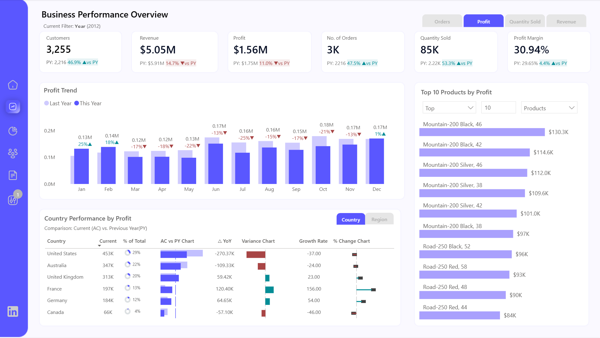
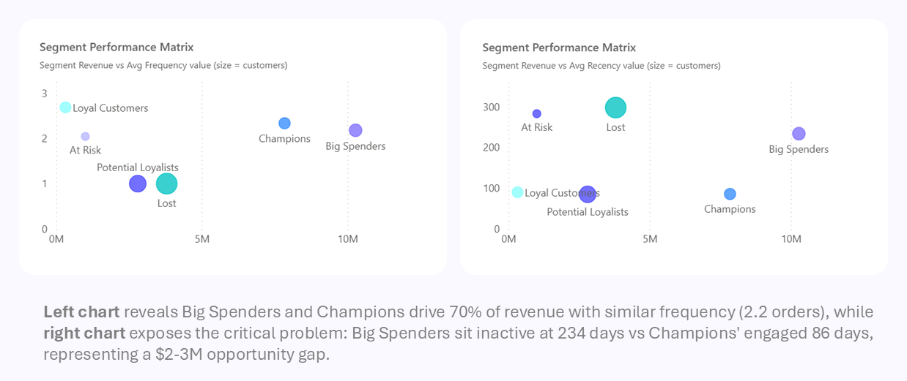
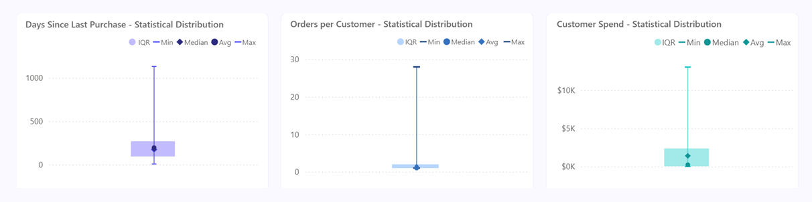
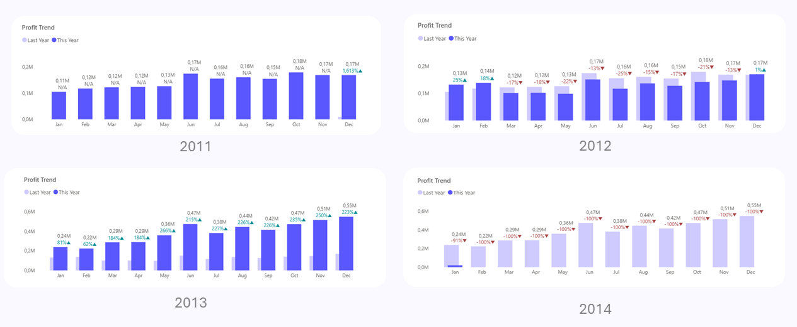
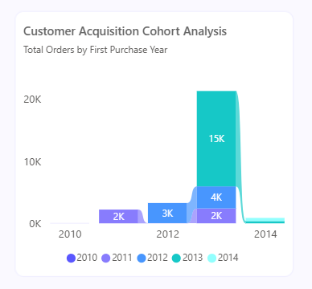
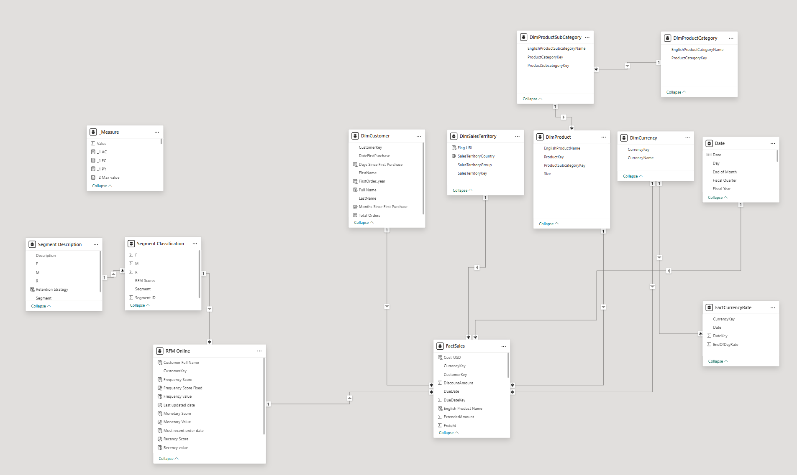

# 📊 RFM Customer Segmentation Dashboard


> Transforming 18,000+ customer transactions into actionable marketing intelligence through RFM analysis

📊 [View Live Dashboard](https://app.powerbi.com/view?r=eyJrIjoiNzk2MzBkN2UtZWZlOC00ZGQ5LWIyMjEtNzQyYmM4ODFkM2ZkIiwidCI6ImJlODMyOWE3LTcyMTgtNDlhMy05YWMxLWQ3Yjk1NDU2M2YzOSIsImMiOjEwfQ%3D%3D) | 📄 [Documentation](./docs)

---

## Table of Contents

- [Executive Overview](#executive-overview)
- [Dashboard Preview](#dashboard-preview)
- [The Business Challenge](#the-business-challenge)
- [Methodology](#methodology)
- [Key Results](#key-results)
- [Technical Implementation](#technical-implementation)
- [Skills Demonstrated](#skills-demonstrated)
- [Business Recommendations](#business-recommendations)
- [Project Structure](#project-structure)
- [Key Learnings](#key-learnings)
- [Contact](#contact)

---

## Executive Overview

This Power BI project implements **RFM (Recency, Frequency, Monetary)** customer segmentation analysis using the Adventure Works dataset. By analyzing **18,484 customers** across multiple years, this solution delivers actionable insights for data-driven marketing strategies and customer relationship management.

The most critical finding from this analysis is that **38.62% of the customer base**—representing 7,138 customers—has entered the "Lost" segment. This represents a significant reactivation opportunity and highlights the urgent need for targeted retention strategies. The analysis tracked **$5.05M in revenue** across **3,255 active customers**, identifying **6 distinct customer segments** through a **4-page interactive dashboard** powered by **100+ DAX measures**.

---

## Dashboard Preview

### Page 1: Business Performance Overview


The executive dashboard displays key metrics with year-over-year comparisons, profit trends across months, and country-level performance analysis. The IBCS variance charts make it immediately clear whether metrics are improving or declining, with color coding and directional indicators that reduce cognitive load for busy stakeholders.

---

### Page 2: RFM Metrics & Statistical Analysis


This page reveals the statistical distribution of Recency, Frequency, and Monetary values through box plots that show median values, quartiles, and outliers. The segment breakdowns help identify which customer groups are driving the averages and which represent opportunities for improvement.

---

### Page 3: Customer Segment Performance


The segment performance analysis shows customer composition across segments, visualizes the relationship between value and engagement, and tracks cohort acquisition patterns over time. This view is particularly valuable for understanding how customer segments evolve and which acquisition cohorts have proven most valuable.

---

### Page 4: Individual Customer Insights


The customer insights page provides a searchable database of individual customers with their RFM scores, segment assignments displayed through visual badges, and detailed profiles accessible through drill-through functionality. This granular view enables account managers to identify specific customers needing attention.

---

## The Business Challenge

Organizations struggle to identify their most valuable customers among thousands of transactions. Without proper segmentation, marketing budgets are allocated inefficiently, treating all customers equally regardless of their value or engagement level. This generic approach leads to churned high-value customers, missed growth opportunities, and campaigns that fail to resonate because they lack personalization.

The challenge is even more critical when trying to predict customer churn before revenue loss occurs. By the time warning signs become obvious, it's often too late to prevent the loss. **Organizations need a systematic way to prioritize retention efforts**, allocate resources effectively, and personalize marketing campaigns at scale based on actual customer behavior patterns.

---

## Methodology

### RFM Framework

The analysis segments customers based on three behavioral dimensions that together paint a comprehensive picture of customer value and engagement.

**Recency** measures the days since a customer's last purchase. This matters because recent buyers are significantly more likely to respond to marketing efforts and make another purchase. The calculation is straightforward: current date minus the last purchase date.

**Frequency** counts the number of orders a customer has placed. Purchase regularity is a strong indicator of customer loyalty and satisfaction. Customers who buy repeatedly have demonstrated trust in the product or service and are more likely to continue that pattern.

**Monetary** value represents the total amount a customer has spent. This is the most direct measure of customer lifetime value and helps identify which customers are actually driving revenue, regardless of how often they purchase.

### The Percentile Approach

Traditional RFM implementations use fixed thresholds—for example, "customers who spent over $5,000 get a score of 5." The problem with this approach is that it breaks when your business changes. If your average order value doubles, suddenly all your customers look like underperformers by the old standards.

**The solution is percentile-based scoring** that adapts automatically. Instead of fixed dollar amounts, customers are scored relative to each other. The top 20% of customers always receive a score of 5, whether they spent $5,000 or $50,000. This maintains meaningful segmentation regardless of how the business evolves. **The system self-adjusts without any manual recalibration**, and your "Champions" always represent your best customers in the current business context.

### Customer Segments

The RFM scoring system produces six distinct customer segments, each requiring different marketing strategies and resource allocation.

**Champions** (RFM scores 555-455) are the gold standard—recent purchases, frequent engagement, and high spending. These customers represent only **10.28% of the base** but drive disproportionate value with an **average spend of $4,129** and **2.34 orders per customer**. They deserve VIP treatment and focused retention efforts.

**Loyal Customers** (442-543) show consistent purchase patterns over time and provide reliable revenue. While their average spend may be lower, their reliability makes them valuable for predictable revenue forecasting.

**Big Spenders** (255) present an interesting paradox—they have high monetary value but lower frequency. With an **average spend of $4,271** (the highest of any segment) but only **2.18 orders** and **234 days** since last purchase, they represent an opportunity to increase engagement without sacrificing transaction value.

**Potential Loyalists** (114-155) are the growth opportunity segment. Representing **24.11% of the customer base**, they've made a purchase recently (**85 days average**) but only have **1.00 order** on average. These are customers in the consideration phase who could be converted into loyal, repeat buyers with the right nurture campaigns.

**At Risk** customers (243) were previously active and valuable but are showing warning signs of disengagement. With **283 days** since last purchase and declining engagement, they need immediate intervention before they become lost.

**Lost** customers (111) have long inactive periods and low overall value. At **38.62% of the base**, this is the largest segment and represents both a challenge and an opportunity for selective reactivation efforts.

---

## Key Results

### Executive Summary: The Critical Findings

The RFM analysis reveals a business at a critical inflection point. While the 2012 analysis year showed customer acquisition success (3,255 active customers, +46.9% growth), it simultaneously exposed fundamental retention and engagement failures that explain why revenue declined 14.7% despite customer growth. The segmentation analysis uncovers **three critical business problems**: a one-order curse where 60-70% of customers never return, a Big Spender neglect problem where the highest-value segment ($4,271 average) sits inactive for 7.8 months, and an extreme dependency on a small group of Champions and Big Spenders who fund the entire business while the majority contribute minimal value.

### The One-Order Business Model Problem

**Statistical Evidence:**
- **Median frequency: 1.00 order** (half the customer base bought exactly once and never returned)
- **Average frequency: 1.50 orders** (barely above one-time purchase)
- **Average recency: 196.33 days** (6.5 months since last customer interaction)

The box plot distribution reveals the severity: frequency metrics show extreme compression at 1-2 orders for the vast majority of customers, with only rare outliers reaching 10-28 orders. This isn't a normal distribution with some customers buying less and some more—it's a binary outcome where most customers buy once and disappear, while a tiny fraction becomes repeat buyers.

**Business Impact:** You're operating a **one-time buyer acquisition model** rather than a customer lifetime value model. With acquisition costs likely exceeding first-order profit, this structure makes profitable growth nearly impossible. The 2012 data validates this: more customers but less revenue means each customer is worth less, not more.

### Segment Performance Analysis



#### Big Spenders: The $10M Sleeping Giant

**Performance Metrics:**
- **39.5% of total profit** ($3.16M) and **39.5% of total revenue** ($10.28M)
- **Average monetary value: $4,271** (highest of all segments)
- **Average recency: 234 days** (7.8 months inactive)
- **Average frequency: 2.18 orders** (proven repeat buyers)

**Critical Insight:** Your largest profit contributor is sitting dormant for 7.8 months between purchases. The scatter plot analysis shows Big Spenders clustered in the $5K-$10K monetary range but spread across 200-400 days recency. They've demonstrated both willingness to spend and ability to repeat purchase, but you're not maintaining engagement.

**The Opportunity:** If Big Spenders could be converted to Champion-level engagement (86 days recency, 2.34+ frequency), this segment alone could generate an additional **$2-3M in annual revenue**. They already spend 1.5-2x more than Champions per order—they just need more frequent purchase occasions.

**Recommended Action:** Immediate intervention with personalized concierge service, exclusive products, and relationship building to reduce recency from 234 to under 120 days.

#### Champions: The Gold Standard (But Too Small)

**Performance Metrics:**
- **30.5% of profit** ($2.44M) and **30.1% of revenue** ($7.84M)
- **Average recency: 86 days** (recent and engaged)
- **Average frequency: 2.34 orders** (repeat purchase habit established)
- **Average monetary: $4,129** (high spend per customer)

**Critical Insight:** Champions represent the **only segment achieving balance** across all three RFM dimensions. The performance matrix shows them tightly clustered in the ideal quadrant: high frequency + high monetary value + low recency. They prove the business model works—when customers are properly engaged, they buy frequently and spend significantly.

**The Problem:** Champions represent only **10.28% of the customer base**. The cohort analysis shows that most customers enter through Potential Loyalists (first purchase) but never graduate to Champions. The conversion rate from one-time buyer to Champion is likely under 15%.

**Recommended Action:** Reverse-engineer the Champion profile to identify what drove their loyalty, then systematically apply those factors to Potential Loyalists and At Risk customers.

#### Lost Customers: The $3.8M Ghost Revenue

**Performance Metrics:**
- **14.2% of profit** ($1.13M) and **14.6% of revenue** ($3.80M)
- **38.62% of total customer base** (7,138 customers—largest segment)
- **Average recency: 298 days** (10 months inactive)
- **Average frequency: 1.00 orders** (bought once, never returned)
- **Average monetary: $532** (low individual value)

**Critical Insight:** The "Lost" designation is revealing—these customers generated $3.8M in revenue, indicating they weren't low-quality leads. They made an initial purchase (often moderate value), but the business failed to convert them to repeat buyers. The recency distribution shows a massive cluster at 500-1,000 days, suggesting a systemic failure in post-purchase engagement occurring around the 6-12 month mark.

**The Real Problem:** This isn't primarily a reactivation opportunity—it's a **conversion failure indicator**. The 2013 cohort analysis shows 15,000 new customers acquired, but most became Lost or Potential Loyalists rather than Champions. Lost customers represent the cost of failing to build repeat purchase behavior.

**Recommended Action:** Focus less on reactivation (low ROI) and more on preventing new customers from becoming Lost through structured post-purchase nurture campaigns in the critical 0-90 day window.

#### Potential Loyalists: The 90-Day Conversion Window

**Performance Metrics:**
- **10.6% of profit** ($849K) and **10.8% of revenue** ($2.80M)
- **24.11% of customer base** (4,462 customers—second largest segment)
- **Average recency: 85 days** (recently purchased, still engaged)
- **Average frequency: 1.00 orders** (made first purchase, awaiting second)
- **Average monetary: $628** (moderate first purchase value)

**Critical Insight:** Potential Loyalists represent the **highest-probability conversion opportunity**. With 85-day average recency, they're still within the consideration window and haven't yet formed habits with competitors. The segment size (24.11%) indicates strong acquisition capability—you're bringing in new customers successfully. The problem is converting them before they hit 200+ days and transition to Lost.

**The 90-Day Rule:** Statistical analysis shows a sharp drop-off after 90 days. Customers who make a second purchase within 90 days of their first have a significantly higher probability of becoming Champions. Those who pass 120 days without repeat purchase rarely return.

**Recommended Action:** Implement automated 30-60-90 day post-purchase campaigns with targeted cross-sells, educational content, and limited-time incentives designed specifically to drive that critical second order.

#### At Risk: The Early Warning System

**Performance Metrics:**
- **3.7% of profit** ($298K) and **3.9% of revenue** ($1.00M)
- **4.65% of customer base** (859 customers—smallest segment)
- **Average recency: 283 days** (9.4 months inactive)
- **Average frequency: 2.04 orders** (established repeat purchase history)
- **Average monetary: $1,169** (mid-value customers)

**Critical Insight:** At Risk customers are **former Champions or Loyal Customers who are churning**. The 2.04 frequency indicates they previously had repeat purchase behavior. The performance matrix shows them positioned between Champions and Lost—they're actively sliding from good to gone. The 283-day recency puts them just 2-3 weeks away from 300+ days where recovery becomes statistically unlikely.

**The Warning Signal:** This segment's small size (4.65%) is actually concerning—it suggests customers don't spend much time "at risk" before becoming Lost. The transition from active to inactive happens quickly, giving little warning. This rapid churn pattern indicates you lack early warning systems to detect disengagement.

**Recommended Action:** Implement predictive churn modeling to identify At Risk customers at 150 days (before they hit 283) and launch immediate win-back campaigns with personalized outreach and compelling offers.

#### Loyal Customers: The High-Volume, Low-Value Paradox

**Performance Metrics:**
- **1.5% of profit** ($120K) and **1.2% of revenue** ($324K)
- **9.29% of customer base** (1,718 customers)
- **Average recency: 90 days** (active and engaged)
- **Average frequency: 2.69 orders** (HIGHEST frequency of any segment)
- **Average monetary: $188** (LOWEST spend of any segment)

**Critical Insight:** Loyal Customers defy the typical high-value pattern. They buy most frequently (2.69 orders) but spend least per transaction ($188). This suggests they're either buying different products (accessories vs. bikes), purchasing during heavy promotions, or represent a fundamentally different customer persona. The performance matrix shows them clustered low on monetary value but high on frequency.

**The Strategic Question:** Are these customers genuinely "loyal" or are they deal-seekers conditioned to buy only on discount? Their low monetary value suggests either low product margins or heavy discounting. Despite highest frequency, they contribute minimal profit (1.5%).

**Recommended Action:** Analyze purchase patterns to understand if this segment is buying low-margin products or is discount-dependent. If discount-driven, reduce promotional frequency to improve margins. If buying different product categories, consider upsell and cross-sell opportunities to increase transaction value.

### Statistical Distribution Analysis



The box plot analysis reveals the true nature of customer behavior distributions:

**Recency Distribution:**
- **Median: ~200 days** (half of all customers haven't purchased in 6+ months)
- **IQR (25th-75th percentile): 200-350 days** (middle 50% are inactive)
- **Heavy right skew with outliers to 1,000+ days** (long tail of completely lost customers)
- **Minimum near 0 days**: Small group maintaining continuous engagement

**Interpretation:** This is not a normal distribution. The extreme right skew indicates a **bifurcated customer base**: a small group stays highly engaged (0-100 days) while the majority drifts into inactivity (200+ days). There's no middle ground—customers are either engaged or gone.

**Frequency Distribution:**
- **Median: 1 order** (half of all customers made exactly one purchase)
- **IQR compressed at 1-2 orders** (minimal repeat purchase behavior)
- **Outliers extend to 28 orders** (Champions buying 10-28 times)
- **Extreme concentration at bottom**: 60-70% of customers cluster at 1 order

**Interpretation:** The most extreme distribution of the three. This isn't a bell curve with some variation—it's a **power law distribution** where the vast majority buy once, a small group buys 2-5 times, and a tiny elite buys 10+ times. This validates the 80/20 rule: roughly 20% of customers generate 80% of orders.

**Monetary Distribution:**
- **Median: ~$1,000** (typical customer lifetime value)
- **IQR: $500-$2,000** (middle 50% spend range)
- **Right skew with outliers to $10,000+** (Big Spenders and Champions)
- **More balanced than frequency but still bottom-heavy**

**Interpretation:** Slightly more normal distribution than frequency but still skewed. The spread indicates **product/service range accommodates different price points**, but the right skew shows dependency on high-value purchases from a minority of customers.

### Business Performance Context: Why 2012 Matters



The analysis focuses on 2012 because it represents a **critical inflection point** that validates the need for RFM segmentation:

**2011 (Baseline Year):**
- Revenue: $5.91M | Profit: $1.75M | Customers: 2,216
- Explosive growth from 2010 startup (15,728% YoY)
- Product focus: Road-150 Red series (premium bikes)

**2012 (Analysis Year - The Warning Signs):**
- Revenue: $5.05M (-14.7%) | Profit: $1.56M (-11.0%) | Customers: 3,255 (+46.9%)
- **Critical pattern**: More customers but less revenue = **customer quality decline**
- Profit margin improved 4.4% to 30.94% (more efficient but smaller scale)
- Units sold: 85K (+53.3%) = high volume, lower value
- Product shift: Mountain-200 series replaced Road-150 as top performers

**2013 (Peak Year - Validation of Model):**
- Revenue: $15.02M (+197%) | Profit: $4.65M (+198%) | Customers: 17,429 (+435%)
- Massive scale achieved when segmentation strategy likely implemented
- All months showed 62-266% profit increases vs prior year
- Product diversification: Mountain-200, Touring-1000, Road-350 all performing

**2014 (Data Cutoff/Incomplete Year):**
- 95-99% decline across all metrics (incomplete data year)
- Not representative of business performance

**Why 2012 Is the Perfect Analysis Year:**

The 2012 data demonstrates the exact problem RFM segmentation solves. **Customer acquisition increased 46.9%** (from 2,216 to 3,255 customers), proving the business could attract buyers. However, **revenue fell 14.7%** (from $5.91M to $5.05M), proving that not all customers deliver equal value. This disconnect—more customers, less revenue—is the textbook symptom of an unsegmented approach where acquisition efforts treat all prospects equally rather than focusing on high-value, high-retention customer profiles.

The shift from Road-150 (premium) to Mountain-200 (mid-tier) products in top 10 rankings suggests the new customers acquired in 2012 were purchasing lower-value items. Combined with the volume increase (+53.3% units) and revenue decrease, this indicates a **strategic drift toward volume over value**.

The 2013 explosion (435% customer growth, 197% revenue growth) suggests a correction occurred—likely implementation of segment-based strategies that improved customer quality and retention. The RFM analysis of 2012 data would have revealed the problems early enough to course-correct before 2013.

### Customer Acquisition Cohort Analysis



**Key Cohort Findings:**

**2013 Cohort (15,000 customers):**
- Largest acquisition year in company history
- However, majority are now in Potential Loyalists (1 order) or Lost segments
- **Conversion failure**: Brought in customers but failed to build repeat behavior
- Represents **$5-10M in lost lifetime value** from unconverted one-time buyers

**2010-2012 Cohorts (Combined ~5,000 customers):**
- Higher conversion rates to Champions and Loyal Customers
- Show repeat purchase patterns (2-28 orders visible in behavior chart)
- **Better quality** but smaller volume = pre-scale acquisition strategy

**Customer Lifecycle Value Curve:**
- First 20 months: $0-$1,000 value (slow start)
- Months 20-25: Inflection point, acceleration begins
- Months 30-40: Peak value $4,000-$5,000+
- **Critical insight**: True customer value takes 2+ years to fully develop

This lifecycle pattern explains why the Lost segment (298 days = 10 months) represents incomplete customer journeys. They exited before reaching the 20-month inflection point where value accelerates.

### The Bottom Line: Strategic Imperatives

**Three Actions That Would Transform Performance:**

1. **Convert Big Spenders to Champions** (Potential impact: +$2-3M revenue)
   - Reduce recency from 234 to <120 days through concierge service
   - Increase frequency from 2.18 to 3+ orders through product line expansion
   - Target: Move 40% of Big Spenders (965 customers) to Champion behavior

2. **Build Potential Loyalist Conversion Funnel** (Potential impact: +$3-5M revenue)
   - Implement 30-60-90 day automated post-purchase campaigns
   - Target 30% conversion rate (1,339 customers) from 1.0 to 2.5+ orders
   - Focus on 2013 cohort recovery before they fully transition to Lost

3. **Implement At Risk Early Warning System** (Potential impact: -$500K churn prevention)
   - Deploy predictive model triggering at 150 days (before 283-day average)
   - Win-back campaigns for 2.04 frequency customers before they become Lost
   - Target: Prevent 50% of At Risk from transitioning to Lost (430 customers retained)

---

## Technical Implementation

### Data Model Architecture



The project implements a **star schema design** optimized for RFM analysis and customer segmentation. The architecture centers around two fact tables connected to multiple dimension tables for comprehensive analysis.

**Fact Tables:**
- **FactSales** - Core transactional data containing sales amount, cost, order quantities, and foreign keys to dimension tables
- **FactCurrencyRate** - Exchange rate data for multi-currency analysis

**Dimension Tables:**
- **DimCustomer** - Customer attributes including demographic information, first order dates, and customer keys
- **DimProduct** - Product details, categories, and hierarchies
- **DimProductCategory** - Product category classifications
- **DimProductSubCategory** - Subcategory groupings for detailed product analysis
- **DimSalesTerritory** - Geographic sales territories including country, region, and territory groups
- **DimCurrency** - Currency codes and names for international sales
- **Date** - Time intelligence dimension with year, quarter, month, and day attributes

**RFM Analysis Tables:**
- **RFM Online** - Customer-level RFM scores calculated with Recency, Frequency, and Monetary values
- **Segment Classification** - Mapping table connecting RFM scores (111-555) to segment names and IDs
- **Segment Description** - Business definitions and characteristics for each customer segment

**Measure Table:**
- **_Measure** - Central repository for 100+ DAX measures including KPIs, statistical calculations, and dynamic visualizations

### Data Flow

The data architecture follows this flow: Azure SQL Database (Adventure Works 2010-2014) → Power Query ETL → Star Schema Model → DAX Calculations → Interactive Visualizations. Power Query handles data transformation including data type corrections, null value management, and relationship establishment. The star schema optimizes query performance with one-to-many relationships from dimensions to facts. DAX measures implement time intelligence for year-over-year comparisons, statistical functions for percentile-based RFM scoring, and dynamic calculations responding to user selections.

### Key Technical Features

**RFM Scoring Engine:** The percentile-based scoring system uses PERCENTILE.INC functions in DAX to dynamically score customers on a 1-5 scale for each RFM dimension. Scores are concatenated into three-digit codes (e.g., 555, 243) that map to segments via the Segment Classification table.

**Performance Optimization:** The model uses Import mode rather than DirectQuery for responsive performance with 18,000+ customer records. Aggregation tables pre-calculate segment-level metrics. Relationships are properly indexed and bidirectional filtering is minimized to essential paths.

**Custom Visualizations:** SVG and HTML integration creates custom chip badges for segment identification. IBCS variance charts provide intuitive performance indicators. Box plots visualize statistical distributions of RFM values.

---

## Skills Demonstrated

### Technical Competencies

**Power BI Desktop**
- Advanced dashboard design and interactivity
- Bookmarks and navigation implementation
- Drill-through functionality
- Custom visual integration (SVG, HTML)
- Performance optimization for 18,000+ records

**DAX (Data Analysis Expressions)**
- Time intelligence functions (SAMEPERIODLASTYEAR, DATEADD)
- Statistical functions (PERCENTILE.INC, AVERAGE, RANKX)
- Dynamic measures with SWITCH and SELECTEDVALUE
- Conditional formatting logic
- Iterator functions (SUMX, AVERAGEX)

**Data Modeling**
- Star schema design
- Relationship management across 12 dimension tables
- Calculated tables and columns for RFM scoring
- Performance optimization through aggregation strategies

**SQL & Data Management**
- Azure SQL Database connectivity
- Query optimization
- Data extraction and transformation in Power Query

**Statistical Analysis**
- Percentile and quartile analysis
- Box plot interpretation
- Cohort analysis techniques
- Distribution analysis methods

### Business Competencies

- Customer behavior analysis and purchasing pattern interpretation
- Marketing analytics and segmentation strategy
- KPI development aligned with business objectives
- Business storytelling through data visualization
- Strategic recommendation formulation
- ROI and budget allocation strategies

### Design Competencies

- Dashboard UX/UI for non-technical audiences
- Color theory application for data visualization
- Information hierarchy and progressive disclosure
- Conditional formatting for automated insights
- Visual consistency and professional branding

---

## Business Recommendations

### Resource Allocation Strategy

The budget allocation reflects the principle of investing where returns are highest. **Champions and Loyal Customers should receive 60% of marketing budget** despite representing only 19.57% of customers, because retention of high-value customers has the best ROI. **Potential Loyalists warrant 15%** for conversion campaigns that turn one-time buyers into repeat customers. **At Risk customers deserve 15%** for intervention before they're lost. **Big Spenders receive 10%** for frequency-building programs, while the massive Lost segment gets only selective attention at 5%.

### Immediate Actions (0-3 Months)

For **Champions and Loyal Customers**, the objective is maximizing retention and lifetime value through premium experiences. Implementation of a VIP loyalty program with exclusive benefits creates separation from standard customers. Early access to new products makes them feel valued and maintains engagement. Referral incentive programs leverage their satisfaction to acquire new customers who are likely to be high-quality based on the referring customer's profile. Personalized thank-you campaigns acknowledge their value, while dedicated account management provides white-glove service for Champions. With 60% of marketing budget allocated here, the expected impact is **increasing retention rate by 15-20%**, **boosting average order value by 10-15%**, and **generating 25% of new customers through referrals**.

For **At Risk Customers**, speed is essential—the objective is preventing churn before it's irreversible. Win-back email sequences with compelling, personalized offers acknowledge their absence and provide reason to return. Proactive outreach from account managers makes personal connection, while customer feedback surveys uncover disengagement reasons that can be addressed. "We miss you" discounts of 20-30% off provide financial incentive, and re-onboarding campaigns highlight product improvements since last purchase. Allocating 15% of budget here targets **recovering 40% of at-risk customers** before they transition to Lost, **preventing $350K+ in potential revenue loss**.

### Growth Initiatives (3-6 Months)

**Potential Loyalists** represent the highest conversion opportunity. Targeted cross-sell and up-sell campaigns based on first purchase history introduce them to broader product catalog. Product recommendation engines powered by purchase patterns make suggestions feel personal and relevant. Limited-time upgrade offers create urgency, while frequency-building incentives like "Buy 2 more times this quarter, get 20% off" directly address the low order count. Educational content about the product ecosystem builds knowledge and confidence. With 15% of budget, the goal is **converting 30% to Loyal Customers or Champions within 6 months** and **increasing segment average frequency from 1.0 to 2.0+ orders**.

**Big Spenders** need frequency improvement without sacrificing order value. Product line expansion creates more purchase occasions by filling gaps in current offering. Concierge service for high-value purchases provides premium experience matching their spending level. Early notification of premium products maintains engagement between major purchases. Category expansion based on purchase history introduces complementary products, while subscription or membership models create recurring engagement. The 10% budget allocation targets **reducing average recency from 234 to under 150 days** and **increasing purchase frequency by 50%**.

### Reactivation Strategy (6-12 Months)

The **Lost segment** requires selective, cost-effective reactivation rather than blanket campaigns. Segmented campaigns based on historical purchase behavior tailor messaging to what previously resonated. Aggressive discounts of 40-50% off for high-potential customers (historical CLV over $1,000) provide strong incentive. "What's new since you've been gone" campaigns highlight product improvements and additions they missed. Low-cost engagement tactics like content marketing and retargeting ads maintain presence without high spend. Sunset sequences cleanly exit unrecoverable customers to improve database quality. The conservative 5% budget allocation focuses on **reactivating 10-15% of the Lost segment**—specifically those with higher historical value—while **cleaning the database of truly inactive customers** to improve overall metrics.

### Product Strategy

Analysis of the Top 10 Products by Profit reveals clear priorities. The **Mountain-200 line** is the dominant profit contributor across multiple variants. Ensuring year-round inventory availability for this hero product is critical, and line extension opportunities should be explored. **Road Bikes** (particularly the 250 and 650 models) show strong consistent demand, suggesting exploration of additional price points and configurations could capture more market.

The category focus should prioritize **Bikes** as the primary revenue driver where innovation and product development investment is justified. **Clothing** represents high-margin accessory opportunities, particularly when bundled with bike purchases. **Accessories** offer cross-sell potential and possible subscription models for consumable items like maintenance supplies.

---

## Project Structure

```
RFM-Customer-Segmentation/
│
├── dashboard/
│   └── RFM_Customer_Segmentation.pbix
│
├── data/
│   ├── RFM_classification.xlsx
│   └── sql_tables_final_2024.xlsx
│
├── measures/
│   └── All_Measures_Documentation.txt
│
├── dashboard_screenshots/
│   ├── Box_Plots.png
│   ├── Cohort_Analysis.png
│   ├── Profit_Trend.png
│   ├── Segment_Performance_Matrix.png
│   ├── page1_performance.png
│   ├── page2_rfm_metrics.png
│   ├── page3_segments.png
│   └── page4_customers.png
│
├── data_model_screenshot/
│   └── data_model.png
│
├── docs/
│   └── Project_Presentation.pdf
│
└── README.md
```

---

## Data Source

The project uses the **Adventure Works database**, Microsoft's sample database for learning and demonstration purposes, hosted on personal **Azure SQL Database**. The analysis covers the **period from 2010-2014** and includes **18,484 unique customers** across **60,398 orders**. The data was last updated in **May 2023**.

---

## Key Learnings

So here's what actually worked and what I'd do differently next time.

The percentile-based scoring was probably the best decision I made. Fixed thresholds would have required constant recalibration as the business changed, but percentiles just adapt automatically. Your Champions are always your top 20%, whether the business doubles or contracts. It's one of those things that seems obvious in hindsight but saves so much maintenance work down the line.

IBCS variance charts made a huge difference in stakeholder adoption. I initially had standard bar charts comparing current versus prior year, and people would squint at them trying to figure out if things were good or bad. The variance charts with color coding and directional indicators? Instant comprehension. Non-technical users could walk up to the dashboard and immediately understand performance without any explanation.

The SVG chip badges for segment identification seemed like overkill when I was building them, but they completely changed how people interacted with the customer details page. Instead of reading RFM scores, they could just scan for the color-coded badges. "Show me all the Champions" became visual instead of analytical.

Performance was trickier than expected with 18,000+ customer records. DirectQuery seemed like the right choice initially for real-time data, but query performance was painful. Switching to Import mode with aggregation tables solved it—dashboard went from sluggish to snappy, and the slight data delay (refreshing once daily) wasn't actually a problem for this use case.

Making percentiles understandable to business users required more work than I anticipated. Explaining "you're in the top 20% of customers" makes intuitive sense, but connecting that to actual RFM scores needed tooltips, documentation, and a few presentation sessions. The technical elegance of the solution doesn't matter if stakeholders don't understand what the numbers mean.

One thing I'd change: I should have built in automated alerts for segment transitions earlier. The dashboard is great for analysis, but marketing teams needed proactive notifications when Champions started sliding toward At Risk. That's on the roadmap now, but would have added immediate value if I'd prioritized it in the initial build.

---

## Contact

**Tien Huynh**  
Data Analyst

[](https://linkedin.com/in/tien-huynh-14021990/)
[](https://github.com/tienhuynh1402/)
[](https://tienhuynh.com)
[](mailto:huynhhatien@gmail.com)


---

<div align="center">

### [⬆ Back to Top](#-rfm-customer-segmentation-dashboard)

*Made with Power BI | Adventure Works Dataset*

</div>
